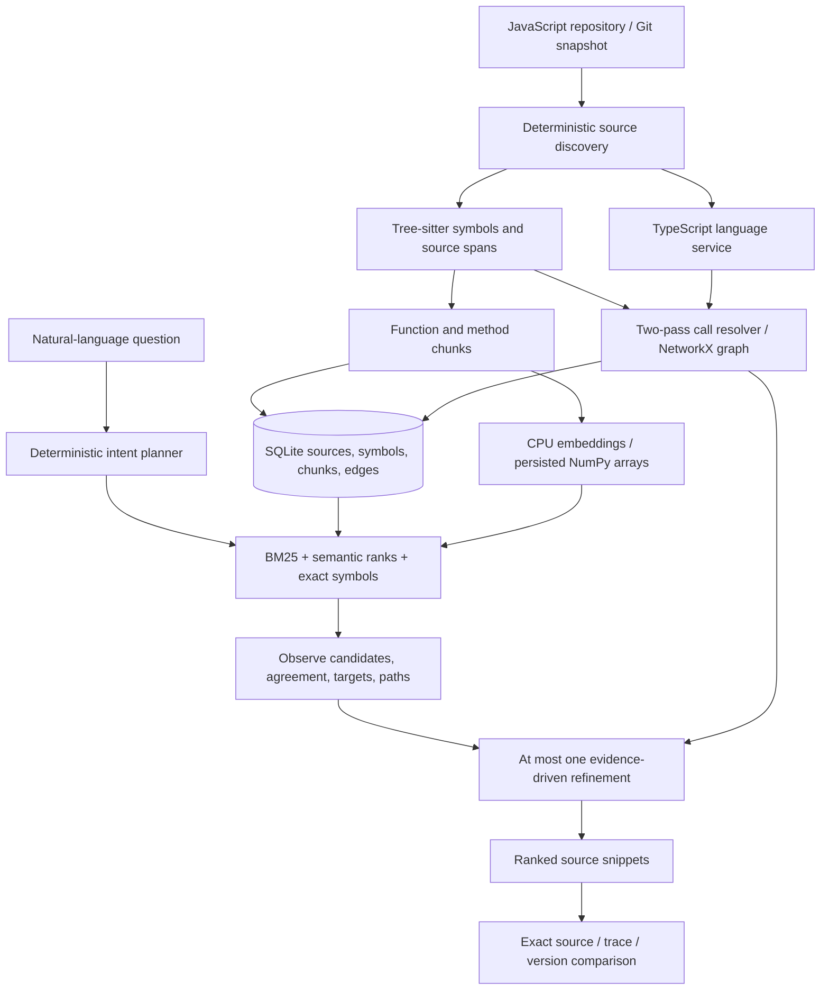

# ASTFLOW

**See what changed. Understand what you built.**

Updated to the supplied editor-video visual reference. See [changes and limits](docs/CHANGES.md).

**Engineering audit (20 September):** [report](docs/audit/REPORT.md), [official requirements matrix](docs/audit/REQUIREMENTS.md), [defect ledger](docs/audit/BUGS.md), [UI inventory](docs/audit/UI-INVENTORY.md) and [remaining checklist](docs/audit/CHECKLIST.md). Full AppsRetrieval scores are substantially lower than the small demo benchmark; use the official figures for screening claims.

ASTFLOW is a local repository investigation engine for JavaScript. Ask a question, get ranked source snippets, follow supported call relationships, and compare the answer across Git snapshots. The snippet list is the canonical answer; graphs and explanations supplement it.

It runs on a CPU, needs no paid API, and never executes an indexed repository. The included source fixture has voice routing, Bluetooth settings, authentication, test cases, dynamic dispatch, and two real Git commits showing a session-management refactor.

## Quick start

Requirements: **Python 3.12** (3.11+ supported), **Node.js 22.12+**, npm, and Git. Run commands from this directory.

```sh
npm run setup
npm run demo
```

Open **http://127.0.0.1:8000**. Setup creates `.venv`, installs Python and Node dependencies, builds the frontend, prepares the demo Git history, and attempts to download the free MiniLM embedding model. The download happens only during setup or the explicit `model-download` command. If unavailable, source search and all structural/version features remain usable with a clearly reported lexical fallback.

`npm run demo` indexes `v1`, `v2`, and the working tree with one shared model instance, then starts FastAPI serving the built React UI. First startup includes model loading; subsequent indexes reuse saved vectors. Stop with Ctrl+C.

On Windows the setup script uses `py -3.12`; on macOS/Linux it uses `python3`. The Python environment can also be prepared manually:

```powershell
py -3.12 -m venv .venv
.\.venv\Scripts\python.exe -m pip install -r requirements.txt
npm ci
npm run build
.\.venv\Scripts\python.exe scripts/setup_demo.py
.\.venv\Scripts\python.exe -m backend.app.cli model-download
npm run demo
```

On macOS/Linux replace `.\.venv\Scripts\python.exe` with `.venv/bin/python`. Activating the environment makes the `astflow` CLI available directly.

## Try the investigation

1. Start in **Code**. Use the Explorer to open files in closable tabs, adjust zoom, and inspect the indexed source.
2. Ask **Where is Bluetooth settings handled?** in the companion composer. Select a source match to inspect its exact lines.
3. Ask **How does VoiceHandler reach BluetoothAgent?** and expand **Investigation** to inspect the retrieval steps.
4. Open **Map**, choose **Trace a path**, enter `VoiceHandler` and `BluetoothAgent`, and press **Trace**. Click an edge to open its call site and supporting evidence.
5. Open **Compare**, select `v1` and `v2`, and compare. Inspect the real before/after source and structural counts. `AuthService.restore` delegates to the added `SessionManager.restore` in v2.
6. Use **Explain** to show or hide the companion and the folder rail button to toggle the explorer. On narrow screens these become drawers.

The demo is source code, not a lookup table. Its query strings are only UI examples and benchmark inputs; the retrieval engine contains no query-specific answers. Demo authentication is deliberately a small fixture, not a production authentication implementation.

## Use another repository

Click the repository name, enter an absolute local path, and choose `working-tree`, `HEAD`, a tag, or a commit. Index each version you want to investigate. Use the sidebar selector to switch snapshots. A passive notice detects working-tree edits. Select **Update snapshot** to create a fresh snapshot when ready; the current evidence stays stable while you read.

```powershell
.\.venv\Scripts\python.exe -m backend.app.cli index C:\projects\my-app --version HEAD
.\.venv\Scripts\python.exe -m backend.app.cli search C:\projects\my-app "Where is input validated?" --version HEAD
.\.venv\Scripts\python.exe -m backend.app.cli compare C:\projects\my-app "session restoration" HEAD~1 HEAD
.\.venv\Scripts\python.exe -m backend.app.cli serve
```

`serve` opens the last indexed workspace. `serve PATH` indexes that path's working tree first. The UI's repository dialog also accepts arbitrary Git revision expressions; only committed source blobs are read, without checkout changes.

## Architecture



```text
backend/app/
  api/           Pydantic request contracts
  parsing/       Tree-sitter JavaScript extraction
  indexing/      Safe discovery, immutable snapshots, orchestration
  retrieval/     Code tokens, BM25, CPU embeddings, rank fusion
  structure/     Static resolver, graph queries, TS enrichment
  agent/         Observable two-pass investigation
  versions/      Symbol, edge, and retrieval comparison
  storage/       SQLite and NumPy persistence
  runtime/       Reserved; runtime execution is not enabled
  main.py        FastAPI and built frontend
  cli.py         Independent CLI entry points
backend/tests/   Parsing, resolution, retrieval, API, Git, semantic tests
frontend/src/    React / TypeScript investigation interface
frontend/e2e/    Live browser integration tests
tools/          In-memory TypeScript compiler analysis
benchmark/      Graded queries, baselines, metrics, dataset adapter, reports
examples/demo-repo/  Actual JavaScript fixture with v1/v2 Git tags
scripts/        Setup, startup, live API verification
.astflow/       Generated indexes, models, screenshots (ignored by Git)
```

## How retrieval works

Discovery reads `.js`, `.mjs`, `.cjs`, and `.jsx`, excludes dependency/generated directories and minified bundles, skips symlinks, and normalizes paths to relative POSIX form. Input order, symbol tables, rankings, and graph serialization are deterministic. Source bytes are preserved as UTF-8; invalid UTF-8 files are reported and skipped.

Tree-sitter extracts functions, named arrow functions, classes, methods, class-field arrows, imports/exports, parameters, bindings, and call expressions. Retrieval chunks follow callable boundaries. Search context includes the qualified name, path, nearby comments, imports used by the callable, and its body. Files without callable units get module chunks of at most 80 lines. Whole-file chunks are not added on top of callable chunks.

Code tokenization splits camelCase, PascalCase, snake_case, and kebab-case while retaining complete identifiers. BM25 uses a positive-IDF formulation so tiny and single-document indexes remain searchable. The configurable default dense model is `sentence-transformers/all-MiniLM-L6-v2`, with normalized CPU embeddings and exact NumPy dot-product ranking.

Lexical and dense rankings are fused with reciprocal rank fusion (`k=60`). Scores are ranking signals, **not probabilities**. Exact symbols, symbol-token overlap, bounded graph proximity, and observed test references contribute small, inspectable boosts. Tests receive a modest downweight in ordinary production-code queries. The candidate pool is at least 50 where available; smaller repositories return the available matching chunks. Normal responses contain ten snippets.

The index stores vectors once, including their chunk-row mapping. There is no vector database and no remote embedding request during search.

## What the agent does

The planner recognizes locate, usage, path, sequence, version, and general intents. The first search is followed by an observation of ranking agreement, exact symbols, file diversity, missing structural targets, and supported paths.

For a structural query, missing target, or weak lexical/dense agreement, a second query incorporates symbols actually found or missed in the first pass. Its ranking contributes a bounded reciprocal-rank term. Graph expansion also uses the observed seeds and resolved query targets. It traverses at most two hops with distance decay. The agent stops after at most two retrieval passes.

The API exposes `PLAN → SEARCH → OBSERVE → REFINE → SEARCH → RERANK → STOP` when refinement is warranted; straightforward searches can stop after one pass. This is an operational activity log, with actual queries and counts. Disabling investigation mode disables the second pass while preserving ordinary hybrid/structural retrieval.

Version intent uses the explicitly selected snapshot. **Changes** runs the question against both selected versions; the engine does not guess an unspecified historical commit.

## Structural evidence and its limits

The resolver completes discovery before resolving any edge. Verified relationships cover supported local calls, same-class normal methods, and direct unconditional constructor-held instances. Relative ES6 named imports must be unaliased, with direct `.js` paths or a missing-`.js` fallback. Default/namespace imports, aliases, directory indexes, re-exports, packages and CommonJS remain unresolved. Class-field methods, accessors, static methods and nested callbacks do not create verified edges.

TypeScript can corroborate an already supported edge, but cannot create an edge the conservative resolver rejected. Parse-error files do not contribute verified relationships. Shadowing, reassignment, duplicate names and unsupported instance assignments cause abstention. Supporting spans preserve the import declaration, constructor assignment and call site where applicable.

SEQUENCE evidence is lexical order, not runtime completion. It requires an identified ordered pair and excludes control-flow/early-exit cases. Vague questions do not receive guessed ordering evidence.

The graph API supports callers, callees, neighbors, shortest paths, and bounded paths. Trace defaults to five edges, has result/expansion limits, and shows only a relevant subgraph. A class name expands to its methods; an exact `path::qualified_name` identifies one symbol unambiguously.

## Versions and storage

Each source snapshot and analysis configuration receives its own content-addressed cache under `.astflow/indexes/<version_key>/`:

```text
index.sqlite          files, symbols, chunks, edges, metadata
embeddings.npy        normalized embeddings, when available
embedding_rows.json   vector-to-chunk mapping
manifest.json         revision, counts, timestamps, timings, model, configuration
```

Sources are served from the stored snapshot. Editing the working tree after indexing cannot change a result's source view. API responses include immutable `version_key` values to preserve this correspondence even when a named branch is later reindexed.

Comparison reports added, removed, and modified symbols; added/removed call sites; simple moved-symbol candidates; both ranked result sets; and rank changes. Stable identity is `path::qualified_name`, with source hashes for content changes. Move detection requires matching qualified names and strongly matching bodies. It is intentionally conservative rather than a general refactoring detector.

## Configuration

See [`.env.example`](.env.example). Variables are read from the process environment; the file is a template, **not automatically loaded**. Ranking weights and limits are centralized in [`backend/app/config.py`](backend/app/config.py).

| Setting | Default | Purpose |
| --- | --- | --- |
| `ASTFLOW_MODEL` | `sentence-transformers/all-MiniLM-L6-v2` | CPU embedding model name or local path |
| `ASTFLOW_SEMANTIC` | `auto` | Use a cached model; `off` forces lexical retrieval |
| `ASTFLOW_CACHE` | `.astflow` in this project | Index/model/state storage |
| `ASTFLOW_TS_ENRICH` | `true` | Enable best-effort compiler enrichment |

Download a changed model explicitly, then reindex:

```powershell
$env:ASTFLOW_MODEL = 'sentence-transformers/all-MiniLM-L6-v2'
.\.venv\Scripts\python.exe -m backend.app.cli model-download
```

No cloud LLM, API key, runtime execution, or external explanation service is configured.

## API

OpenAPI JSON contract: **http://127.0.0.1:8000/openapi.json**. The strict content policy intentionally does not load third-party documentation scripts.

| Route | Purpose |
| --- | --- |
| `GET /api/map?version=…&file=…` | Bounded file overview or symbols in one file, with unresolved evidence |
| `GET /api/checkpoint` | Passive working-tree change status against the indexed snapshot |
| `GET /api/health` | Service/model status |
| `GET /api/repository?version=…` | Active repository, indexed versions, snapshot files |
| `POST /api/index` | `{repo_path, version, background: true}`; background jobs return 202 |
| `GET /api/index/status` | Actual stage, progress, error, and completed manifest |
| `POST /api/search` | `{query, version, top_k: 10, agentic: true}` |
| `POST /api/trace` | `{source_symbol_id, target_symbol_id, version, max_depth: 5}` |
| `GET /api/source` | `path`, `version`, `start_line`, `end_line` |
| `GET /api/versions` | Working tree, HEAD, tags, recent commits, index status |
| `POST /api/compare` | `{query, version_a, version_b}` |
| `GET /api/symbol/{symbol_id}` | Symbol metadata and caller/callee/neighbor IDs |

Search results contain rank, chunk/symbol IDs, qualified name, kind, relative path, inclusive start/end lines, exact source snippet, score, evidence contributions, and snapshot identity. Unindexed versions return an actionable error. Runtime trace IDs are rejected because runtime evidence is not implemented.

The service binds to loopback and validates Host/Origin headers. Source requests only address stored files, reject traversal, and validate line ranges. This is a single-user local prototype, not an authenticated multiuser server. Indexing never invokes `npm install`, tests, or application code in the target repository.

## Verification and benchmarks

Requires the demo Git history from Quick start (`scripts/setup_demo.py`) to already exist; on a fresh clone that has not run Quick start, run it first or `test_indexed_revision_expression_remains_in_version_selector` fails because `examples/demo-repo` is not yet its own Git repository.

```powershell
.\.venv\Scripts\python.exe -m pytest
npm run build
# With npm run demo running in another terminal:
.\.venv\Scripts\python.exe scripts/verify_demo.py
npm run test:ui
.\.venv\Scripts\python.exe -m benchmark.evaluate
```

Browser tests use installed Microsoft Edge by default. For another platform, set the Playwright `channel` in `playwright.config.ts` or install Chromium with `npx playwright install chromium` and remove the Edge channel. Tests use the **real running backend**; they do not mock search or graph responses. They save screenshots under `.astflow/screenshots/`.

Backend coverage includes parser spans/Unicode, named exports, arrows/JSX, deterministic resolution, unsupported-import abstention and cyclic named imports, dynamic and shadowed calls, reassignment and `this` boundaries, conservative sequence ordering, source filters, lexical retrieval, real CPU semantic retrieval, persisted vectors, agent refinement, graph traversal, API/source validation, Git comparison, and real/failing TypeScript enrichment. Semantic integration tests report a skip when the optional model is not installed; language-service tests report a skip when Node dependencies are absent.

The local benchmark computes **NDCG@10, MRR, Recall@10**, median and p95 query latency for BM25-only, dense-only, hybrid, hybrid plus structure, and the full engine. It validates every relevance label against actual indexed symbols. Full per-query rankings and metrics are saved in [`benchmark/results/local.json`](benchmark/results/local.json), with a readable table in [`benchmark/results/local.md`](benchmark/results/local.md). Live API verification measurements are in [`benchmark/results/verification.json`](benchmark/results/verification.json).

The included 16-query/21-chunk benchmark is a small handcrafted regression fixture. It does **not** establish performance on large repositories or an official PRISM/MTEB evaluation. No benchmark numbers are hardcoded into the application. Index time includes CPU model loading on a cold process; query measurements warm the model first.

### Official full AppsRetrieval evaluation

Use a separate Python 3.12 environment for MTEB. From the project root:

```powershell
py -3.12 -m venv .eval-venv
.\.eval-venv\Scripts\python.exe -m pip install -e '.[dev,semantic]' -r benchmark/requirements-mteb.txt
.\.eval-venv\Scripts\python.exe benchmark/run_mteb.py --mode bm25 --output benchmark/results/mteb-bm25
.\.eval-venv\Scripts\python.exe benchmark/run_mteb.py --mode hybrid --download-model --output benchmark/results/mteb-hybrid
.\.eval-venv\Scripts\python.exe -m pytest benchmark/test_mteb_adapter.py
.\.eval-venv\Scripts\python.exe -m benchmark.ablate
```

On Linux use `.eval-venv/bin/python`. Each official run uses MTEB 2.21.0, all 3,765 test queries, all 8,765 documents and pinned dataset revision `f22508f96b7a36c2415181ed8bb76f76e04ae2d5`. `appsretrieval_results.json` is written using the framework serializer. `run_metadata.json` records corpus/model identity and raw timing; `predictions/` retains the ranked document IDs. Upload the generated MTEB JSON as the required release artifact after final review. Large predictions are ignored by Git and excluded from the source ZIP.

Measured full-test NDCG@10: **BM25 .06104; hybrid .08815**. MRR@10: **.052202 / .072400**. These evaluate text retrieval on Python dataset documents; they do not evaluate ASTFLOW's JavaScript graph/agent. Do not substitute the much higher curated demo scores. The full hybrid run contains multi-hour timing outliers and is not a clean throughput benchmark; see the audit report.

Keep the output metadata and evaluation environment's `pip freeze`. Dense/hybrid evaluation fails rather than claiming lexical fallback is semantic retrieval. If a cache was saved by an incompatible sentence-transformers major version, reload the official model with the pinned version.

### Legacy CoIR export/smoke adapter

The optional adapter reads the real `CoIR-Retrieval/apps` dataset used by MTEB's AppsRetrieval task. It uses the patched `datasets` 5.x API, validates current configurations/columns, pins the downloaded dataset revision, and exports ordinary BEIR JSONL/TSV files. It also accepts existing BEIR exports without network access.

```powershell
.\.venv\Scripts\python.exe -m pip install -e '.[benchmark]'
.\.venv\Scripts\python.exe -m benchmark.mteb_appretrieval --download --max-queries 32
# Reuse downloaded files; 0 evaluates every test query against the full corpus:
.\.venv\Scripts\python.exe -m benchmark.mteb_appretrieval --max-queries 0
# Use a local BEIR-format export:
.\.venv\Scripts\python.exe -m benchmark.mteb_appretrieval --data C:\datasets\apps --max-queries 32
```

The default is a **32-query adapter smoke run against the full corpus**, explicitly labeled in `benchmark/results/apps.json` and `apps.md`. It compares BM25, dense, and hybrid retrieval. Apps documents are standalone Python solutions, so this adapter does not invent JavaScript graph or version evidence for them. It is not a run of the official MTEB evaluator and is not an official leaderboard score. Full-split execution is available but takes longer on CPU.

## Development

Run the backend in one terminal and `npm run dev` in another. Vite proxies `/api` to port 8000; open http://127.0.0.1:5173. `npm run build` performs TypeScript checking and a production Vite build. The source viewer and graph are loaded on demand. Monaco and its worker are bundled locally; source viewing requires no CDN.

The checked-in npm lock and Python constraints record the verified dependency set. SQLite indexes and embeddings are rebuildable runtime artifacts. The demo setup script is idempotent and refuses to overwrite unrelated existing demo Git history.

## Validation scope and remaining work

See [changes and limits](docs/CHANGES.md) and [verification](docs/VERIFICATION.md). The fixture is reconstructed and its new measured results replace the unavailable original fixture's local report. Semantic execution is skipped when the optional model is absent. A frozen real-repository evaluation with manually judged relevance is still needed for the original track brief; no such results are invented here.

The current sidekick offers a source-backed map, version comparison and on-demand evidence, not prompt-history capture or automated knowledge of design intent. No additional language or resolver expansion is included.

Implementation references: [Tree-sitter Python bindings](https://github.com/tree-sitter/py-tree-sitter), [Sentence Transformers encoding](https://www.sbert.net/docs/package_reference/sentence_transformer/model.html), and [CoIR Apps dataset](https://huggingface.co/datasets/CoIR-Retrieval/apps).

### Lightweight setup (without downloading the embedding model)

```powershell
$env:ASTFLOW_SEMANTIC = 'off'
npm run setup
npm run demo
```

Source search, map, trace and comparison remain available. To enable dense retrieval later, install `.[semantic]`, remove the `ASTFLOW_SEMANTIC=off` setting, run `astflow model-download`, and reindex.

### Graph exploration

Map starts at files; choose a file to inspect its callables. Select a node to highlight callers/callees, use depth/direction controls, then **Explore calls** for a cross-file neighborhood. **Open source** is separate. Fit/reset return to context. Counts disclose the backend 150-node and frontend 60-node/250-edge bounds; node search searches the loaded view. Arrows mean supported static calls, not observed runtime execution.

### Docker files (execution not yet verified)

```sh
docker build -t astflow .
docker run --rm -p 127.0.0.1:8000:8000 astflow
```

The image builds the frontend and runs as a non-root user with the bundled demo, lexical retrieval and TS corroboration disabled. It needs no host repository mount for that demo. Its container process listens internally on all interfaces; publish only to host loopback as shown. The audit machine's Docker daemon was unavailable, so image build/start is **UNVERIFIED**. Do not claim a tested container submission until these commands and the main journeys pass.
