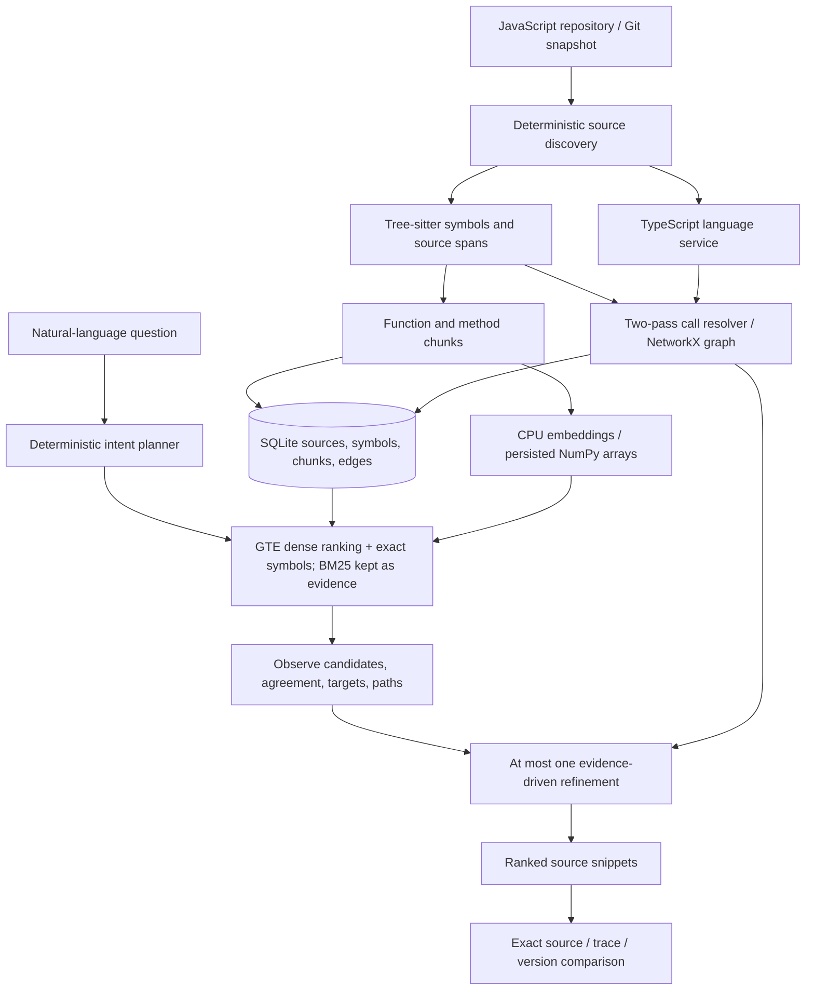

# ASTFLOW

**See what changed. Understand what you built.**

Updated to the supplied editor-video visual reference. See [changes and limits](docs/CHANGES.md).

**Engineering audit (25 September):** [final report and dashboard](audit/FINAL-ASTFLOW-ENGINEERING-REPORT.md), [findings database](audit/findings.json), [remediation plan](audit/18-remediation-plan.md); earlier audit (20 September): [report](docs/audit/REPORT.md), [official requirements matrix](docs/audit/REQUIREMENTS.md), [defect ledger](docs/audit/BUGS.md), [UI inventory](docs/audit/UI-INVENTORY.md) and [remaining checklist](docs/audit/CHECKLIST.md). Full AppsRetrieval scores are substantially lower than the small demo benchmark; use the official figures for screening claims.

> **Submission (Samsung Theme 01, Agentic Code Intelligence).** Official MTEB AppsRetrieval, all 3,765 test queries ×
> 8,765 documents: **NDCG@10 0.5511, MRR@10 0.5053** with the frozen retriever (`Alibaba-NLP/gte-modernbert-base`,
> dense, CPU). Result file: [`benchmark/results/mteb-final-gte/appsretrieval_results.json`](benchmark/results/mteb-final-gte/appsretrieval_results.json),
> also attached to release [`v1.0-submission`](https://github.com/ANUJ-DESHPANDE/ASTFLOW/releases/tag/v1.0-submission).
> The product runs this same configuration by default. Evidence: [technical story](submission/TECHNICAL-STORY.md),
> [judge walkthrough](audit/JUDGE-WALKTHROUGH.md), [final dashboard](submission/FINAL-DASHBOARD.md).

ASTFLOW is a local repository investigation engine for JavaScript. Ask a question, get ranked source snippets, follow supported call relationships, and compare the answer across Git snapshots. The snippet list is the canonical answer; graphs and explanations supplement it.

It runs on a CPU, needs no paid API, and never executes an indexed repository. The included source fixture has voice routing, Bluetooth settings, authentication, test cases, dynamic dispatch, and two real Git commits showing a session-management refactor.

## Quick start

Requirements: **Python 3.12** (3.11+ supported), **Node.js 22.12+**, npm, and Git. Run commands from this directory.

```sh
npm run setup
npm run demo
```

Open **http://127.0.0.1:8000**. Setup creates `.venv`, installs Python and Node dependencies, builds the frontend, prepares the demo Git history, and downloads the search model **`Alibaba-NLP/gte-modernbert-base`** (149M parameters, Apache-2.0, about 0.6 GB, one time; it runs on CPU). The download happens only during setup or the explicit `model-download` command; after that ASTFLOW works offline. If the download fails, setup stops and says so. ASTFLOW never quietly falls back to a weaker search.

`npm run demo` loads the model, prints what will rank results, indexes the demo's `v1`, `v2` and working tree, then starts FastAPI serving the built React UI. Stop with Ctrl+C. The first line to look for:

```text
Retrieval: Alibaba-NLP/gte-modernbert-base · dense · CPU (frozen submission configuration)
```

The same information is at `GET /api/health` (`retrieval`, `indexed_versions`) and in the UI under **How this works**. On a clean clone on a 4-vCPU GitHub runner, setup took 101 s and the demo was ready 12 s later, with a 1.6 GB `.venv` (`audit/walkthrough/hardware.txt`).

On Windows the setup script uses `py -3.12`; on macOS/Linux it uses `python3`. The Python environment can also be prepared manually:

```powershell
py -3.12 -m venv .venv
.\.venv\Scripts\python.exe -m pip install -r requirements.txt
npm ci
npm run build
.\.venv\Scripts\python.exe scripts/setup_demo.py
.\.venv\Scripts\python.exe -m backend.app.cli model-download
npm run demo
```

On macOS/Linux replace `.\.venv\Scripts\python.exe` with `.venv/bin/python`. On Linux add `--extra-index-url https://download.pytorch.org/whl/cpu` to the `pip install` so it installs the CPU build of PyTorch (as `npm run setup`, CI and the official evaluation do) rather than the multi-GB CUDA build. Activating the environment makes the `astflow` CLI available directly.

## Try the investigation

1. Start in **Code**. Use the Explorer to open files in closable tabs, adjust zoom, and inspect the indexed source.
2. Ask **Where is Bluetooth settings handled?** in the companion composer. Select a source match to inspect its exact lines.
3. Ask **How does VoiceHandler reach BluetoothAgent?** and expand **Investigation** to inspect the retrieval steps.
4. Open **Map**, choose **Trace a path**, enter `VoiceHandler` and `BluetoothAgent`, and press **Trace**. Click an edge to open its call site and supporting evidence.
5. Open **Compare**, select `v1` and `v2`, and compare. Inspect the real before/after source and structural counts. `AuthService.restore` delegates to the added `SessionManager.restore` in v2.
6. Use **Ask** to show or hide the companion and the folder rail button to toggle the explorer. On narrow screens these become drawers; choosing a result or evidence link closes the companion drawer so the opened lines are visible.

The demo is source code, not a lookup table. Its query strings are only UI examples and benchmark inputs; the retrieval engine contains no query-specific answers. Demo authentication is deliberately a small fixture, not a production authentication implementation.

## Use another repository

Click the repository name, enter an absolute local path, and choose `working-tree`, `HEAD`, a tag, or a commit. Index each version you want to investigate. **The first index of a repository is the expensive step:** every callable chunk is embedded by a 149M-parameter model on CPU, with progress shown while it runs. Later versions embed only chunks whose text changed. Measured on a 4-vCPU runner (`index-timing` workflow): expressjs/express 4.18.2, 153 files and 3,226 chunks, **6.2 min (Intel Xeon 8573C) to 11.9 min (AMD EPYC 7763) cold**; then 4.19.2 in 46–79 s (2,955 vectors reused, 307 computed) and 4.21.2 in 52–93 s. Cost grows with the amount of code rather than the number of files: a 512-token chunk takes about 1–2 s on 4 vCPUs, a short callback far less. More in [`audit/JUDGE-WALKTHROUGH.md`](audit/JUDGE-WALKTHROUGH.md). Use the sidebar selector to switch snapshots. A passive notice detects working-tree edits. Select **Update snapshot** to create a fresh snapshot when ready; the current evidence stays stable while you read.

```powershell
.\.venv\Scripts\python.exe -m backend.app.cli index C:\projects\my-app --version HEAD
.\.venv\Scripts\python.exe -m backend.app.cli search C:\projects\my-app "Where is input validated?" --version HEAD
.\.venv\Scripts\python.exe -m backend.app.cli compare C:\projects\my-app "session restoration" HEAD~1 HEAD
.\.venv\Scripts\python.exe -m backend.app.cli serve
```

`serve` opens the last indexed workspace. `serve PATH` indexes that path's working tree first. The UI's repository dialog also accepts arbitrary Git revision expressions; only committed source blobs are read, without checkout changes.

## Search a snippet corpus (dataset-style queries)

The screening task ranks standalone code snippets for a natural-language problem statement (CoIR Apps). The same
retriever serves that setting directly, with any length of query (a full problem statement is fine):

```sh
astflow snippets --query-file problem.txt                 # CoIR Apps corpus (downloaded once from Hugging Face)
astflow snippets "longest increasing subsequence" --top-k 5
astflow snippets "binary search on the answer" -c v1=lib-v1.jsonl -c v2=lib-v2.jsonl   # two versions at once
```

Ranking is the frozen configuration: GTE dense, exactly as in the official run. The first `apps` search downloads the official run's 8,765 document vectors (a `.npz` asset of release `v1.0-submission`) instead of spending about 4 CPU-hours re-embedding the corpus. Before using them, it re-encodes 8 of them live and requires cosine ≥ 0.995; otherwise it embeds on CPU and says so. Encoding a full problem statement takes about 4 s on 4 vCPUs.

A corpus is BEIR/CoIR JSONL (`_id`, `text`, optional `title`). Every result prints its id, version(s), rank evidence and
the snippet; the header reports index time and how many vectors were reused. Each `-c` is one **version**: vectors are
cached per model by snippet content hash, so a new version embeds only the snippets whose text changed. Searching
several versions ranks each distinct snippet once and folds byte-identical copies into one result that lists every
version holding it, so an unchanged snippet does not fill the top 10 with duplicates; changed variants stay separate
and labelled. `--json` gives machine-readable output.

## Architecture



```text
backend/app/
  api/           Pydantic request contracts
  parsing/       Tree-sitter JavaScript extraction
  indexing/      Safe discovery, immutable snapshots, orchestration
  retrieval/     Code tokens, BM25, CPU embeddings, rank fusion
  structure/     Static resolver, graph queries, TS enrichment
  agent/         Observable two-pass investigation
  versions/      Symbol, edge, and retrieval comparison
  storage/       SQLite and NumPy persistence
  runtime/       Reserved; runtime execution is not enabled
  main.py        FastAPI and built frontend
  cli.py         Independent CLI entry points
backend/tests/   Parsing, resolution, retrieval, API, Git, semantic tests
frontend/src/    React / TypeScript investigation interface
frontend/e2e/    Live browser integration tests
tools/          In-memory TypeScript compiler analysis
benchmark/      Graded queries, baselines, metrics, dataset adapter, reports
examples/demo-repo/  Actual JavaScript fixture with v1/v2 Git tags
scripts/        Setup, startup, live API verification
.astflow/       Generated indexes, models, screenshots (ignored by Git)
```

## How retrieval works

Discovery reads `.js`, `.mjs`, `.cjs`, and `.jsx`, excludes dependency/generated directories and minified bundles, skips symlinks, and normalizes paths to relative POSIX form. Input order, symbol tables, rankings, and graph serialization are deterministic. Source bytes are preserved as UTF-8; invalid UTF-8 files are reported and skipped.

Tree-sitter extracts functions, named arrow functions, classes, methods, class-field arrows, imports/exports, parameters, bindings, and call expressions. Retrieval chunks follow callable boundaries. Search context includes the qualified name, path, nearby comments, imports used by the callable, and its body. Files without callable units get module chunks of at most 80 lines. Whole-file chunks are not added on top of callable chunks.

The first-stage ranking is the frozen configuration: **`Alibaba-NLP/gte-modernbert-base` embeddings (512-token cap, normalized, CPU) ranked by exact cosine similarity**, the same scoring as the official AppsRetrieval run. The model runs in float32. Its checkpoint is float16, which ran 6× slower on CPUs without half-precision hardware (most laptops, AMD EPYC runners) and no faster elsewhere. float32 vectors agree with the evaluated float16 ones at cosine ≥ 0.9995 (`benchmark/experiments/EXPERIMENTS.md`, RETRIEVAL FREEZE). BM25 (code-aware tokens: camelCase, PascalCase, snake_case and kebab-case are split while complete identifiers are kept) is still computed. It is shown as keyword evidence and drives the "shares a word or symbol" label, but in dense mode it does not add to the score. `ASTFLOW_RETRIEVAL=hybrid` restores BM25 + dense reciprocal rank fusion (`k=60`), and `bm25` gives lexical only.

Scores are ranking signals, **not probabilities**. Exact symbols, symbol-token overlap, bounded graph proximity, and observed test references contribute small, inspectable boosts. Tests receive a modest downweight in ordinary production-code queries. The candidate pool is at least 50 where available; smaller repositories return the available matching chunks. Normal responses contain ten snippets.

The index stores vectors once, including their chunk-row mapping. There is no vector database and no remote embedding request during search.

## What the agent does

The planner recognizes locate, usage, path, sequence, version, and general intents. The first search is followed by an observation of ranking agreement, exact symbols, file diversity, missing structural targets, and supported paths.

For a structural query, missing target, or weak lexical/dense agreement, a second query incorporates symbols actually found or missed in the first pass. Its ranking contributes a bounded reciprocal-rank term. Graph expansion also uses the observed seeds and resolved query targets. It traverses at most two hops with distance decay. The agent stops after at most two retrieval passes.

The API exposes `PLAN → SEARCH → OBSERVE → REFINE → SEARCH → RANK → STOP` when refinement is warranted; straightforward searches can stop after one pass. This is an operational activity log, with actual queries and counts. Disabling investigation mode disables the second pass while preserving the first-stage ranking and structural expansion.

Version intent uses the explicitly selected snapshot. **Changes** runs the question against both selected versions; the engine does not guess an unspecified historical commit.

## Structural evidence and its limits

The resolver completes discovery before resolving any edge. Verified relationships cover supported local calls, same-class normal methods, and direct unconditional constructor-held instances. Relative ES6 named imports must be unaliased, with direct `.js` paths or a missing-`.js` fallback. Top-level CommonJS `require('./x')` bindings (plain, destructured, or `require('./x').name`) resolve against `module.exports`, `exports.name` and members of an export-object alias (`var app = module.exports = {}`), and `require('./dir')` resolves to `dir/index.js`; an export key assigned two different values, nested `require` calls and packages stay unresolved. On express 4.21.2 this turns 0 cross-file edges into 11, each checked against its call site (`backend/tests/test_commonjs.py`). Default/namespace ES imports, aliases and re-exports remain unresolved. Functions assigned to members are named by their key (`exports.parse = function () {}` is `parse`). Plain identifier calls inside nested functions and callbacks resolve through the enclosing scopes (parameters, local declarations and reassignments are honoured at every level); member calls from nested scopes, class-field methods, accessors and static methods do not create verified edges. On real code this matters: with nested-scope identifier calls, expressjs/express (141 files) goes from 14 to 286 edges and lodash from 24 to 1,572, and every added edge was independently confirmed by the TypeScript language service (`audit/evidence/resolver-nested-measure.json`). Most calls in such repositories are still member or CommonJS calls and stay unresolved.

TypeScript can corroborate an already supported edge, but cannot create an edge the conservative resolver rejected. Parse-error files do not contribute verified relationships. Shadowing, reassignment, duplicate names and unsupported instance assignments cause abstention. Supporting spans preserve the import declaration, constructor assignment and call site where applicable.

SEQUENCE evidence is lexical order, not runtime completion. It requires an identified ordered pair and excludes control-flow/early-exit cases. Vague questions do not receive guessed ordering evidence.

The graph API supports callers, callees, neighbors, shortest paths, and bounded paths. Trace defaults to five edges, has result/expansion limits, and shows only a relevant subgraph. A class name expands to its methods; an exact `path::qualified_name` identifies one symbol unambiguously.

## Versions and storage

Each source snapshot and analysis configuration receives its own content-addressed cache under `.astflow/indexes/<version_key>/`:

```text
index.sqlite          files, symbols, chunks, edges, metadata
embeddings.npy        normalized embeddings, when available
embedding_rows.json   vector-to-chunk mapping
manifest.json         revision, counts, timestamps, timings, model, configuration
```

Sources are served from the stored snapshot. Editing the working tree after indexing cannot change a result's source view. API responses include immutable `version_key` values to preserve this correspondence even when a named branch is later reindexed.

Comparison reports added, removed, and modified symbols; added/removed call sites; simple moved-symbol candidates; both ranked result sets; and rank changes. Stable identity is `path::qualified_name`, with source hashes for content changes. Move detection requires matching qualified names and strongly matching bodies. It is intentionally conservative rather than a general refactoring detector.

## Configuration

See [`.env.example`](.env.example). Variables are read from the process environment; the file is a template, **not automatically loaded**. Ranking weights and limits are centralized in [`backend/app/config.py`](backend/app/config.py).

| Setting | Default | Purpose |
| --- | --- | --- |
| `ASTFLOW_MODEL` | `Alibaba-NLP/gte-modernbert-base` | CPU embedding model (the frozen submission model) |
| `ASTFLOW_SEMANTIC` | `on` | `on`: the model is required; indexing stops with an actionable error if it is missing. `off`: explicit lexical-only mode, labelled as such everywhere |
| `ASTFLOW_RETRIEVAL` | `dense` | First-stage ranking: `dense` (frozen), `hybrid` (BM25 + dense RRF) or `bm25` |
| `ASTFLOW_CACHE` | `.astflow` in this project | Index/model/state storage |
| `ASTFLOW_TS_ENRICH` | `true` | Enable best-effort compiler enrichment |

Download a changed model explicitly, then reindex:

```powershell
$env:ASTFLOW_MODEL = 'sentence-transformers/all-MiniLM-L6-v2'   # e.g. the previous, smaller model
.\.venv\Scripts\python.exe -m backend.app.cli model-download
```

Any configuration other than the defaults is reported as "NOT the frozen submission configuration" at startup and in `/api/health`.

No cloud LLM, API key, runtime execution, or external explanation service is configured.

## API

OpenAPI JSON contract: **http://127.0.0.1:8000/openapi.json**. The strict content policy intentionally does not load third-party documentation scripts.

| Route | Purpose |
| --- | --- |
| `GET /api/map?version=…&file=…` | Bounded file overview or symbols in one file, with unresolved evidence |
| `GET /api/checkpoint` | Passive working-tree change status against the indexed snapshot |
| `GET /api/health` | Service/model status |
| `GET /api/repository?version=…` | Active repository, indexed versions, snapshot files |
| `POST /api/index` | `{repo_path, version, background: true}`; background jobs return 202 |
| `GET /api/index/status` | Actual stage, progress, error, and completed manifest |
| `POST /api/search` | `{query, version, top_k: 10, agentic: true}`; queries up to 32,000 characters (full problem statements) |
| `POST /api/trace` | `{source_symbol_id, target_symbol_id, version, max_depth: 5}` |
| `GET /api/source` | `path`, `version`, `start_line`, `end_line` |
| `GET /api/versions` | Working tree, HEAD, tags, recent commits, index status |
| `POST /api/compare` | `{query, version_a, version_b}` |
| `GET /api/symbol/{symbol_id}` | Symbol metadata and caller/callee/neighbor IDs |

Search results contain rank, chunk/symbol IDs, qualified name, kind, relative path, inclusive start/end lines, exact source snippet, score, evidence contributions, and snapshot identity. Unindexed versions return an actionable error. Runtime trace IDs are rejected because runtime evidence is not implemented.

The service binds to loopback and validates Host/Origin headers. Source requests only address stored files, reject traversal, and validate line ranges. This is a single-user local prototype, not an authenticated multiuser server. Indexing never invokes `npm install`, tests, or application code in the target repository.

## Verification and benchmarks

The demo fixture sources are committed in `examples/demo-repo`; its Git history (tags `v1`, `v2`) is created by `scripts/setup_demo.py` (run by `npm run setup` and `npm run demo`). On a fresh clone that has not run setup, run that script first or `test_indexed_revision_expression_remains_in_version_selector` fails because `examples/demo-repo` is not yet its own Git repository.

```powershell
.\.venv\Scripts\python.exe -m pytest backend/tests benchmark --ignore=benchmark/test_mteb_adapter.py
.\.venv\Scripts\python.exe -m benchmark.verify_retrieval --self-test   # evaluator agreement on golden cases
npm run build
# With npm run demo running in another terminal:
.\.venv\Scripts\python.exe scripts/verify_demo.py
npm run test:ui
.\.venv\Scripts\python.exe -m benchmark.evaluate
```

`npm run test:ui` runs the demo-critical journeys (`frontend/e2e/journeys.spec.ts`), an accessibility gate (`a11y.spec.ts`: no serious/critical axe violations in the code, answer, map, compare and dialog views at desktop and phone sizes) and the studio/audit specs. Browser tests use installed Microsoft Edge by default; elsewhere run `npx playwright install chromium` and set `PLAYWRIGHT_CHANNEL=chromium`. `PLAYWRIGHT_BASE_URL` points them at another server. Tests use the **real running backend**; they do not mock search or graph responses (one test injects network failures deliberately). They save screenshots under `.astflow/screenshots/`. CI (`.github/workflows/ci.yml`) runs lint, the Python tests, the frontend build, dependency audits and these browser tests on every push.

Backend coverage includes parser spans/Unicode, named exports, arrows/JSX, deterministic resolution, unsupported-import abstention and cyclic named imports, dynamic and shadowed calls, reassignment and `this` boundaries, conservative sequence ordering, source filters, lexical retrieval, real CPU semantic retrieval, persisted vectors, agent refinement, graph traversal, API/source validation, Git comparison, and real/failing TypeScript enrichment. Semantic integration tests report a skip when the optional model is not installed; language-service tests report a skip when Node dependencies are absent.

The local benchmark computes **NDCG@10, MRR, Recall@10**, median and p95 query latency for BM25-only, dense-only, hybrid, hybrid plus structure, and the full engine. It validates every relevance label against actual indexed symbols. Full per-query rankings and metrics are saved in [`benchmark/results/local.json`](benchmark/results/local.json), with a readable table in [`benchmark/results/local.md`](benchmark/results/local.md). Live API verification measurements are in [`benchmark/results/verification.json`](benchmark/results/verification.json).

The included 16-query/21-chunk benchmark is a small handcrafted regression fixture (its committed numbers were measured with the previous MiniLM default and are not part of the submission). It does **not** establish performance on large repositories or an official PRISM/MTEB evaluation. The committed table was regenerated on 2026-09-25 with the MiniLM model available (an earlier committed version had been produced without it, so its dense row was empty and its "hybrid" row was lexical-only). On these 16 queries dense-only (NDCG@10 0.931) scores above hybrid (0.905) and the full agent pipeline (0.866, best MRR 0.969); with 16 queries none of these differences is statistically meaningful. No benchmark numbers are hardcoded into the application. Index time includes CPU model loading on a cold process; query measurements warm the model first.

### Official full AppsRetrieval evaluation

Use a separate Python 3.12 environment for MTEB. From the project root:

```powershell
py -3.12 -m venv .eval-venv
.\.eval-venv\Scripts\python.exe -m pip install -c requirements.lock.txt -e '.[dev,semantic]' -r benchmark/requirements-mteb.txt
.\.eval-venv\Scripts\python.exe benchmark/run_mteb.py --mode bm25 --output benchmark/results/mteb-current-bm25
.\.eval-venv\Scripts\python.exe benchmark/run_mteb.py --mode hybrid --download-model --output benchmark/results/mteb-current-hybrid
.\.eval-venv\Scripts\python.exe -m pytest benchmark/test_mteb_adapter.py
.\.eval-venv\Scripts\python.exe -m benchmark.ablate
```

On Linux use `.eval-venv/bin/python`. Each official run uses MTEB 2.21.0, all 3,765 test queries, all 8,765 documents and pinned dataset revision `f22508f96b7a36c2415181ed8bb76f76e04ae2d5`. `appsretrieval_results.json` is written using the framework serializer. `run_metadata.json` records corpus/model identity and raw timing; `predictions/` retains the ranked document IDs. Upload the generated MTEB JSON as the required release artifact after final review. Large predictions are ignored by Git and excluded from the source ZIP.

Current code (`benchmark/results/mteb-current-*`, MTEB 2.21.0, all 3,765 queries): **BM25 NDCG@10 0.06312, MRR@10 0.054209; hybrid NDCG@10 0.0884, MRR@10 0.072573** (Recall@100 0.22603 / 0.29774). These equal the frozen trust-harness baseline (`benchmark/verification/manifest-baseline-v1.json`, four independent evaluators), which was re-generated from the committed code in the 2026-09-25 audit with 0 per-query metric changes. The runner emits rank-derived scores so MTEB scores ASTFLOW's actual order: hybrid RRF scores contain exact ties that MTEB would otherwise re-order by document id (that variant reported 0.089). The older folders `results/mteb`, `mteb-bm25` (.06104) and `mteb-hybrid` (.08815) came from earlier code states and are historical. These evaluate text retrieval on Python dataset documents; they do not evaluate ASTFLOW's JavaScript graph/agent. Do not substitute the much higher curated demo scores. The full hybrid run contains multi-hour timing outliers and is not a clean throughput benchmark; see the audit report.

Keep the output metadata and evaluation environment's `pip freeze`. Dense/hybrid evaluation fails rather than claiming lexical fallback is semantic retrieval. If a cache was saved by an incompatible sentence-transformers major version, reload the official model with the pinned version.

### Frozen submission configuration (2026-09-26)

The submitted AppsRetrieval result is **`gte-modernbert-base`, Dense, 512 tokens: NDCG@10 0.5511, MRR@10 0.5053**
(`benchmark/results/mteb-final-gte/`, MTEB 2.21.0, all 3,765 test queries). Reproduce on one CPU machine (hours: the
corpus and the long test queries are encoded on CPU):

```sh
python benchmark/run_mteb.py --mode dense --model Alibaba-NLP/gte-modernbert-base --download-model --diagnostics --output out/mteb-final
```

or in about 25 minutes of wall-clock time with `.github/workflows/final-retrieval.yml` (document shards) and
`official-final.yml` (test-query shards + one MTEB run with `--precomputed`, which re-verifies the shard vectors live).
Selection history and the freeze record: `benchmark/EXPERIMENTS.md`, `benchmark/experiments/EXPERIMENTS.md`. The
product uses this configuration by default (repository search, `astflow snippets`, UI and API).

### Development/validation split and BM25 tuning

The AppsRetrieval task only defines a `test` split — there is no official held-out
development set to tune against. Repeatedly checking a code change's score against the
full official test set and keeping whichever change scores best is a form of overfitting
to that test set, even though nothing here ever reads relevance labels into the ranking
algorithm itself. `benchmark/build_dev_split.py` partitions the test split's *query IDs*
(never the corpus) into a `dev` half for iterating on changes and a `confirmation` half
touched at most once, right before deciding whether a change is worth an official run:

```sh
.eval-venv/bin/python -m benchmark.build_dev_split       # once; writes benchmark/dev_split.json
.eval-venv/bin/python -m benchmark.analyze_corpus         # token-length + stopword-candidate evidence, no qrels
.eval-venv/bin/python -m benchmark.tune_bm25               # k1/b grid search on dev queries only
.eval-venv/bin/python -m benchmark.tune_bm25 --confirm --k1 <best> --b <best>   # once, before adopting a config
```

`tune_bm25.py` needs no embedding model (BM25 tuning is model-independent) and appends
every run to `benchmark/results/bm25-tuning-log.json` with the git commit and timestamp.
See `docs/audit/RETRIEVAL-EXPERIMENTS.md` for the experiment log format and
`docs/audit/THEME1-LIVE-GAP-MATRIX.md` for what this tooling does and does not establish.
The grid was run on the real dataset on 2026-09-21 (26 configurations on dev; the current
k1 1.6 / b 0.75 is the dev optimum). The log also shows the confirmation split was used three
times (k1 1.6 twice, 1.5 once), which the protocol forbids; later experiments therefore treat
confirmation as not pristine for BM25 parameters. All retrieval experiments since then
(E001-E004) are recorded in [`benchmark/EXPERIMENTS.md`](benchmark/EXPERIMENTS.md).

### Legacy CoIR export/smoke adapter

The optional adapter reads the real `CoIR-Retrieval/apps` dataset used by MTEB's AppsRetrieval task. It uses the patched `datasets` 5.x API, validates current configurations/columns, pins the downloaded dataset revision, and exports ordinary BEIR JSONL/TSV files. It also accepts existing BEIR exports without network access.

```powershell
.\.venv\Scripts\python.exe -m pip install -e '.[benchmark]'
.\.venv\Scripts\python.exe -m benchmark.mteb_appretrieval --download --max-queries 32
# Reuse downloaded files; 0 evaluates every test query against the full corpus:
.\.venv\Scripts\python.exe -m benchmark.mteb_appretrieval --max-queries 0
# Use a local BEIR-format export:
.\.venv\Scripts\python.exe -m benchmark.mteb_appretrieval --data C:\datasets\apps --max-queries 32
```

The default is a **32-query adapter smoke run against the full corpus**, explicitly labeled in `benchmark/results/apps.json` and `apps.md`. It compares BM25, dense, and hybrid retrieval. Apps documents are standalone Python solutions, so this adapter does not invent JavaScript graph or version evidence for them. It is not a run of the official MTEB evaluator and is not an official leaderboard score. Full-split execution is available but takes longer on CPU.

## Development

Run the backend in one terminal and `npm run dev` in another. Vite proxies `/api` to port 8000; open http://127.0.0.1:5173. `npm run build` performs TypeScript checking and a production Vite build. The source viewer and graph are loaded on demand. Monaco and its worker are bundled locally; source viewing requires no CDN.

The checked-in npm lock and Python constraints record the verified dependency set. SQLite indexes and embeddings are rebuildable runtime artifacts. The demo setup script is idempotent and refuses to overwrite unrelated existing demo Git history.

## Validation scope and remaining work

See [changes and limits](docs/CHANGES.md) and [verification](docs/VERIFICATION.md). The fixture is reconstructed and its new measured results replace the unavailable original fixture's local report. Semantic execution is skipped when the optional model is absent. A frozen real-repository evaluation with manually judged relevance is still needed for the original track brief; no such results are invented here.

The current sidekick offers a source-backed map, version comparison and on-demand evidence, not prompt-history capture or automated knowledge of design intent. No additional language or resolver expansion is included.

Implementation references: [Tree-sitter Python bindings](https://github.com/tree-sitter/py-tree-sitter), [Sentence Transformers encoding](https://www.sbert.net/docs/package_reference/sentence_transformer/model.html), and [CoIR Apps dataset](https://huggingface.co/datasets/CoIR-Retrieval/apps).

### Lightweight setup (without downloading the embedding model)

```powershell
$env:ASTFLOW_SEMANTIC = 'off'
npm run setup
npm run demo
```

Source search, map, trace and comparison remain available. To enable dense retrieval later, install `.[semantic]`, remove the `ASTFLOW_SEMANTIC=off` setting, run `astflow model-download`, and reindex.

### Graph exploration

Map starts at files; choose a file to inspect its callables. Select a node to highlight callers/callees, use depth/direction controls, then **Explore calls** for a cross-file neighborhood. **Open source** is separate. Fit/reset return to context. Counts disclose the backend 150-node and frontend 60-node/250-edge bounds; node search searches the loaded view. Arrows mean supported static calls, not observed runtime execution.

### Docker (lexical-only image)

```sh
docker build -t astflow .
docker run --rm -p 127.0.0.1:8000:8000 astflow
```

The image builds the frontend and runs as a non-root user with the bundled demo and TS corroboration disabled. It is **lexical-only** (`ASTFLOW_SEMANTIC=off`, no model in the image), so it is *not* the frozen submission configuration, and it says so at startup and in `/api/health`. Use `npm run setup` for the frozen configuration. It needs no host repository mount for the demo. Its container process listens internally on all interfaces; publish only to host loopback as shown. CI builds the image, starts it and answers a real query on every push (`docker` job in `.github/workflows/ci.yml`).
