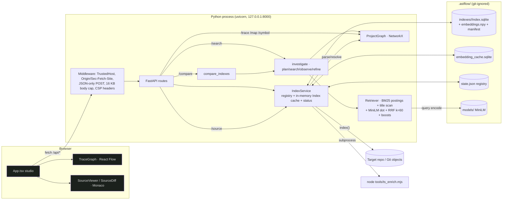

# 04 · Architecture — documented vs actual runtime

## Components (from the tree, verified by reading every module)

| Area | Files | Role |
|---|---|---|
| CLI | `backend/app/cli.py` | Typer: `index`, `search`, `compare`, `serve`, `model-download`, `demo`, `benchmark` |
| HTTP API | `backend/app/main.py`, `api/schemas.py` | FastAPI app factory; security middleware; 12 JSON routes + static frontend |
| Indexing | `indexing/discovery.py`, `indexing/service.py` | Snapshot read (working tree walk or `git ls-tree`/`cat-file` for revisions), content-addressed index folders, status |
| Parsing | `parsing/javascript.py` | tree-sitter-javascript: symbols, callable chunks, imports/exports, calls, sequences |
| Structure | `structure/resolver.py`, `structure/graph.py`, `structure/typescript.py`, `tools/ts_enrich.mjs` | Two-pass conservative call resolver; NetworkX DiGraph; TS language service corroborates (never adds) edges |
| Retrieval | `retrieval/search.py`, `embeddings.py`, `embedding_cache.py`, `reranker.py` | BM25 (sparse postings) + title scan, MiniLM dense, RRF, boosts; optional (rejected) cross-encoder |
| Agent | `agent/investigate.py` | Regex intent plan → search → observe → optional second pass → graph expansion → sort |
| Versions | `versions/compare.py` | Two independent investigations + symbol/edge diff |
| Storage | `storage/store.py` | SQLite (files, symbols, chunks, edges, metadata) + `embeddings.npy` + row map |
| Runtime | `runtime/__init__.py` | Empty placeholder ("runtime execution is not enabled") |
| Frontend | `frontend/src/App.tsx` (+6 components) | Single-page studio: Code (Monaco), Map/Trace (React Flow), Compare (Monaco diff), companion chat, repository dialog |
| Benchmark | `benchmark/*` (43 files) | Local 16-query fixture benchmark, MTEB runner, frozen-run trust harness, E001–E004 experiment tooling |
| Scripts | `scripts/setup.mjs`, `start.mjs`, `setup_demo.py`, `verify_demo.py`, `audit_api.py`, `container_start.py` | Install, start, deterministic demo Git history, live checks, container entrypoint |

## Actual runtime architecture (traced)

### Execution traces

1. **Startup (`npm run demo`)**: `scripts/start.mjs` → checks `.venv` and `frontend/dist` → spawns
   `python -m backend.app.cli demo` → `scripts/setup_demo.setup()` (builds v1/v2 Git history inside
   `examples/demo-repo`) → `import backend.app.main` (**module-level `app = create_app()` builds a first,
   unused `IndexService`**) → `create_app()` again → `service.index(demo, v)` for `v1`, `v2`, `working-tree` →
   `uvicorn.run(127.0.0.1:8000)`.
2. **Indexing (`POST /api/index` or CLI)**: `IndexService.index` (global `RLock`) → `read_snapshot` → content hash →
   index key `sha256(repo, revision, digest, settings.fingerprint(), embedder.status)` → reuse folder if present
   (corrupt → renamed aside) → else `parse_file` per file → `resolve_structure` → `enrich` (Node subprocess, 45 s
   timeout) → `_embed_chunks` (content-hash cache, only new chunks encoded) → `save_index` to a staging folder →
   atomic rename with retry → `_construct` builds `Retriever` + `ProjectGraph` → registry persisted to `state.json`.
   Background mode runs this in a daemon thread and exposes progress through `/api/index/status`, which the UI
   polls every second.
3. **Search (`POST /api/search`)**: `service.get(version)` (alias → key → cached `Index` or load from disk) →
   `investigate` → `plan` (regex intent + exact symbol names) → `Retriever.rank(query, "hybrid", boosts=True)` →
   observe (agreement, exact matches, missing targets) → optional second `rank` with discovered symbols (bounded RRF
   contribution) → optional 2-hop graph expansion (distance-decayed boost) → sort → top-k serialized with evidence →
   subgraph + sequence evidence. Frontend then fetches `/api/source` for the first result and opens a Monaco tab.
4. **Map**: `GET /api/map` — no file: file-level overview (≤150 files, cross-file edges deduplicated); `file`:
   callable symbols in that file (≤150); `symbol` + `depth≤3`: neighborhood BFS (≤150). Frontend lays out with
   `graphLayout.ts` (deterministic layered layout) and renders ≤60 nodes / ≤250 edges.
5. **Trace**: `POST /api/trace` → `ProjectGraph.trace` → ambiguity check → resolve names (class → methods) →
   bounded BFS over callees (≤20 paths, ≤10,000 expansions) → status `SUPPORTED` / `NO_STATIC_PATH_FOUND` /
   `SEARCH_LIMIT_REACHED` / `AMBIGUOUS_SYMBOL`.
6. **Compare**: `POST /api/compare` → two full `investigate` calls + symbol/edge diff + conservative move detection →
   frontend fetches both file versions → Monaco `DiffEditor`.
7. **Checkpoint**: UI polls `GET /api/checkpoint` every 15 s while viewing the working tree; server re-reads and
   re-hashes the whole working tree at most every 10 s.

### Documented architecture vs reality

| README statement | Reality | Verdict |
|---|---|---|
| "BM25 + semantic ranks + exact symbols … at most one evidence-driven refinement" | Matches `investigate()` | Accurate |
| `PLAN → SEARCH → OBSERVE → REFINE → SEARCH → RERANK → STOP` | "RERANK" is a sort of accumulated scores, no model | Accurate text, misleading step name (F-017) |
| Retrieval "fused with reciprocal rank fusion (k=60)" | Yes; plus an undocumented optional cross-encoder behind `ASTFLOW_RERANKER_ENABLED` | Incomplete (F-014) |
| "The included source fixture has voice routing, Bluetooth…" | Fixture was a dangling gitlink in every clone until `b2ea145` | Was false (F-001) |
| `runtime/` "Reserved; runtime execution is not enabled" | Empty package | Accurate |
| Structure/TS enrichment corroborates only | `enrich()` never adds edges (`edges_added` always 0) | Accurate |

## Duplication and structural observations

- **Two app instances per process** when started via the CLI (module-level `app` in `main.py`). Harmless today
  (lazy model load) but doubles `IndexService`/SQLite initialisation. (F-018)
- **Unused corpus tokenisations** in `Retriever.__init__`: `self.corpus_title`, `self.corpus_text` are built for every
  index and never read; `lexical_scores` instead re-tokenises every chunk's `qualified_name` on every query
  (O(chunks) Python loop per query). (F-019)
- **Three MTEB result folders** (`results/mteb`, `mteb-bm25`, `mteb-hybrid`) from different historical code states;
  none corresponds to the current code. (F-020)
- **Two reranker implementations**: `backend/app/retrieval/reranker.py` (wired into `Retriever`) and the inline
  `CrossEncoder` in `benchmark/run_reranker_benchmark.py` (the one actually benchmarked in E002).
- Frontend source is written as dense one-liners (`App.tsx` lines up to 1,881 chars; `studio.css` lines up to
  14,088 chars) — reviewable only with a formatter; Semgrep could not fully parse two files. (F-021)
