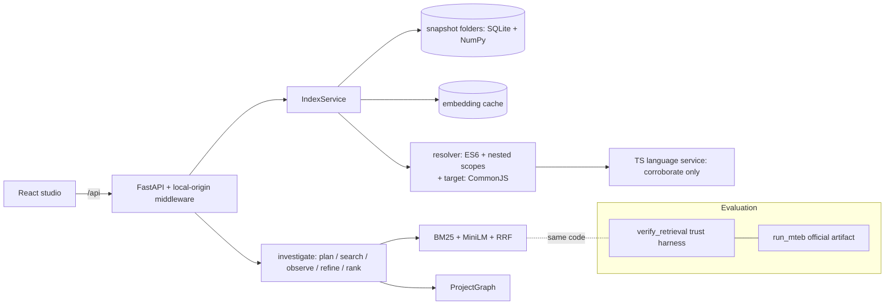

# 17 · Target architecture

Principle: the simplest architecture that satisfies S1 and the product claims. The current single-process design
(FastAPI + SQLite/NumPy snapshots + in-memory indexes + a single-page React UI) is appropriate for a local, single-user,
CPU-only code-retrieval tool. **No rewrite, no new services, no framework change is justified by the evidence.**

## Current vs target

| Area | Current (after this remediation) | Target | Why / evidence |
|---|---|---|---|
| Process model | One Python process (uvicorn) + optional Node subprocess for TS corroboration | same | Loopback single user; measured latencies are small (in-process search P50/P95: demo 6/13 ms, express 43/50 ms, lodash 54/76 ms after F-037/F-045) |
| Storage | Content-addressed snapshot folders (SQLite + `embeddings.npy`) + content-hash embedding cache | same; add an index for `/api/versions` refs state (F-035) | Reuse works (v2 reused 13/21 vectors); only `/api/versions` is slow |
| Retrieval | BM25 (title field precomputed) + MiniLM dense + RRF k=60 + small boosts; agent adds ≤ 1 refinement | same pipeline, experiments decide changes: E004 (full-query dense) pending approval; E005 candidate (offline NL descriptions for code) | Candidate generation is the limit (Recall@100 0.30); E001–E003 rejected fusion/reranker/windows changes |
| Reranking | none (E002 cross-encoder rejected and removed) | none unless a code-trained reranker passes a pre-registered experiment | E002: −0.0187 NDCG@10 |
| Structure | Conservative resolver; nested-scope identifier calls (TS-confirmed) | + conservative CommonJS `require`/`module.exports`/`exports.x` resolution, verified by TS corroboration and a judged sample (F-029) | Real repos have 0 cross-file edges |
| Graph UI | React Flow, ≤ 60 nodes, file overview → file focus → neighbourhood | + directory clustering and "connected files first" in the overview (F-030); display names for property-assigned functions (F-031) | Overview of a 141-file repo is an edgeless grid |
| Evaluation | Frozen trust harness (4 evaluators) + official MTEB artifact that now matches it | same; CI runs the self-test on every PR and MTEB on demand | Reproduced baseline exactly; MTEB agrees |
| Frontend code | Dense one-line TSX/CSS | Formatted (no-behaviour-change commit) (F-021) | Reviewability, static-analysis coverage |
| Delivery | README + `npm run setup` / `demo`; CI (added); Docker unverified | CI green on GitHub; Docker verified on a Docker host | F-040, F-041 |

## Explicitly not proposed

- A vector database, microservices, a queue, or a hosted LLM: no measured bottleneck requires them and S1 asks for
  CPU-first, small models.
- Replacing React Flow or Monaco: both work; the defects found were configuration/usage issues (fixed).
- A reranker "for sophistication": E002 measured one as harmful.
