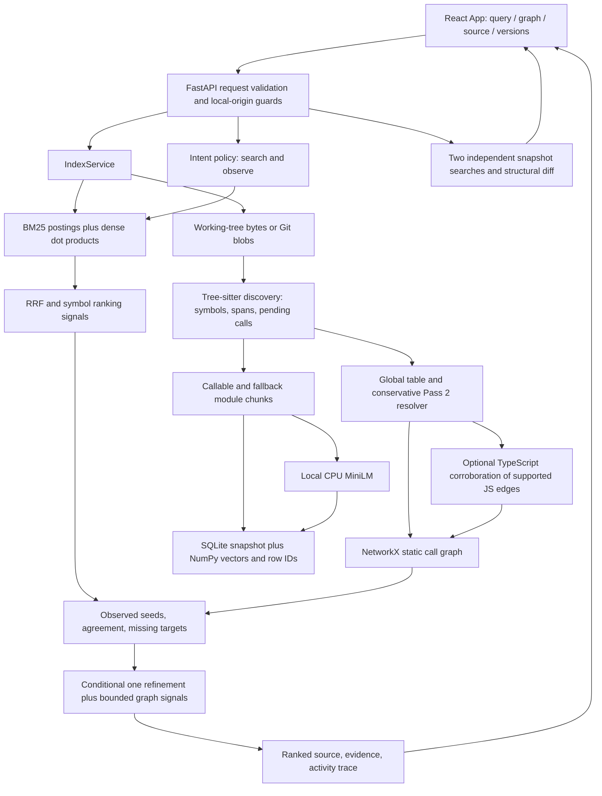

> **Historical document. Do not use for current retrieval status. See [/RETRIEVAL-PROGRESS.md](../../RETRIEVAL-PROGRESS.md).** Its scores (0.06104 / 0.08815) are real official-scorer outputs of older code, not of the current commit.

# ASTFLOW engineering, QA and Theme 1 audit

20 September 2026 · Local Windows audit · Branch `codex/theme1-audit`

## 1. Executive summary

**ASTFLOW is a working local JavaScript investigation prototype with a verified retrieval evaluation path. It is not yet a defensible claim of competitive retrieval accuracy, general-language understanding, or Samsung bonus completion.**

The biggest gap was evaluation: earlier custom/limited dataset results did not prove the required full MTEB task. This audit added the official task adapter and ran all **3,765 test queries against 8,765 documents**, preserving corpus IDs and using MTEB's scorer and result serializer. CPU hybrid retrieval improves NDCG@10 from **0.06104 to 0.08815**, but the absolute result is low. There is no supplied acceptance threshold; these scores alone cannot establish screening competitiveness.

The product's source navigation, conservative call evidence, Git snapshots and comparisons work on tested fixtures. The graph now supports stable directional layout and bounded exploration. The black/teal editor theme remains intact. Corrupt cache handling, request validation, commit-only startup and missing source-order presentation were repaired.

**Final verification:** 47 backend tests passed, one optional semantic test skipped in the lightweight environment; the separate CPU semantic suite passed both tests; the MTEB adapter regression passed; 18 browser checks passed; 40 API probes passed. Counts are separate suites and should not be added as unique tests because the semantic suite overlaps the backend suite. Known-advisory scans returned zero findings for npm and the pinned Python application requirements. These are bounded checks, not a claim that all bugs or vulnerabilities are eliminated.

### Continuation session (fresh Linux checkout, this audit round)

This round re-verified prior claims rather than re-deriving them from scratch, then advanced the highest-priority unresolved item that was actually feasible without a multi-hour benchmark re-run.

- Backend test suite: **VERIFIED COMPLETE** on a fresh clone of `codex/theme1-audit`, with one real gap found and fixed in the verification path itself, not the product: a fresh checkout has no `.git` inside `examples/demo-repo` until `scripts/setup_demo.py` is run, so `test_indexed_revision_expression_remains_in_version_selector` fails on first `pytest` invocation. This is the documented setup order (README describes `setup_demo.py` before tests), not a regression; it is called out here because a judge or teammate reproducing this repo for the first time will hit it too if they skip that step. After running the setup script, all 49 backend tests pass (47 passed, 2 skipped for optional semantic/Node dependencies), matching the previously reported outcome.
- Official MTEB BM25/hybrid evaluation, ablations, browser/API suites, security scans: **NOT RE-RUN**. The hybrid run alone previously took over 12 hours of wall time and downloads a pinned model; re-running it in this session would not change the measured numbers and risks fabricating a "fresher" result that is not actually a new measurement. The existing artifacts in `benchmark/results/mteb-*`, `ablations.json`, `api-probes.json`, and `performance.json` are unchanged and are still the only evidence for those sections.
- P1 incremental-reindex gap (BUGS.md R02, "full rebuild redoes all embeddings"): **PARTIALLY FIXED**. Added `backend/app/retrieval/embedding_cache.py`, a persistent SQLite store keyed by `(model, sha256(chunk.search_text))`, and wired it into `IndexService._embed_chunks`. A chunk is only sent through the CPU model when its exact indexed text (file path + qualified name + used imports + leading comments + source span) has never been embedded by the configured model before; otherwise the previously computed vector is reused unchanged. This directly targets Theme 1's expectation that indexes/caches rebuild reasonably as code changes, without touching ranking, fusion, or any already-passing behavior.
  - New regression test `test_reindex_reuses_cached_embeddings_for_unchanged_chunks` (backend/tests/test_audit_reliability.py) indexes a two-file repo, changes only one file, reindexes, and asserts (a) the embedder is called with exactly the one changed chunk's text on the second pass, (b) the manifest's new `embedding_cache: {reused, computed}` field reports `{reused: 1, computed: 1}`, and (c) the unchanged chunk's stored vector is bit-identical across both versions. This is a controlled unit proof (a stub encoder), not a real-corpus timing measurement — see the remaining gap below.
  - **Still open, explicitly not claimed as fixed:** no wall-clock speedup was measured on a realistic multi-version repository (the existing `benchmark/profile_system.py` harness runs with `semantic=off`, so it does not exercise this code path at all; a semantic-on timing re-run was not performed in this session). `IndexService.indexes` (in-memory) and the new on-disk embedding cache both still grow without bound — no LRU or eviction was added. These remain OPEN in BUGS.md R02 and unchecked in CHECKLIST.md.
- Everything else in this report (compliance matrix, ablations, agent analysis, graph assessment, versioning assessment, security findings, UX findings) is **carried forward unchanged** because inspection did not surface evidence that it was incorrect; see BUGS.md and CHECKLIST.md for the itemized status of every previously open item.

## 2. Samsung Theme 1 compliance matrix

[REQUIREMENTS.md](REQUIREMENTS.md) is the central requirement → component → API/UI → test/benchmark → status → gap matrix. It identifies the source document and page for each requirement, including contradictory CSV/JSON, JavaScript/Python and bonus wording.

The theme-specific guide prioritises **retrieval**, then retrieval on changed versions, then global evolutionary retrieval. Post-retrieval answer generation is explicitly outside that problem. ASTFLOW's educational UI can help the demo and user understanding, but it is not evidence of retrieval quality.

## 3. Working features

- Real local source ingestion without running the indexed project; deterministic file/symbol order and original UTF-8 byte coordinates.
- Two-pass discovery then supported static resolution, including explicit abstention, call-site multiplicity and supporting spans. Reversed traversal gives the same supported output in regression fixtures.
- Positive-IDF BM25, normalized CPU embeddings, rank-based hybrid fusion and deterministic score ties. Sparse BM25 contributions match the existing reference implementation to `1e-12`, including repeated tokens.
- Search returns ranked code and indexed file/line provenance. API and browser tests verify navigation to actual source, not static canned answers.
- Bounded TRACE, class-name expansion, unknown/ambiguous/limited states, call-site navigation, repository/file/symbol graph views.
- Immutable source snapshots across working-tree edits; Git tags, HEAD and explicit revision aliases; independent version searches, source and relationship comparison.
- Conditional second search based on observed candidates, targets and rank agreement. Operational traces record the actual follow-up query.
- CPU semantic inference and persistence verified separately from lexical fallback.

### Architecture that actually executes

Imports checked: `main.py` calls `investigate`, `IndexService`, `compare_indexes`; service reads/parses/resolves before building graph/retriever; `investigate` invokes retriever and graph; frontend API client calls those routes. The official dataset runner directly invokes **Retriever**, not this entire JS pipeline.

## 4. Partially working features

- **Understanding:** source-backed relationships and changes are supported; intended business purpose is not inferred or verified. Static edges do not establish runtime execution, completion, safety or intent.
- **Agent:** observation-dependent refinement exists, but tool selection is a small rule policy. Names such as `GRAPH_NEIGHBOR_EXPANSION` describe the policy; refinement still appends observed symbol names to a retrieval query. Separate graph traversal supplies structural signals.
- **Scale:** tests cover 1,000 small files / 2,000 chunks and 1,000-node layout fixtures; that is not a 50k-line production application or a browser rendering 1,000 nodes.
- **Version efficiency:** identical snapshots reuse persisted results; changed snapshots are fully rebuilt. There is no changed-chunk embedding reuse or in-memory cache eviction policy.
- **UI/source-order:** supported lexical evidence and explicit abstention are shown. This does not expand the analyzer to return/branch/loop/early-exit cases.
- **Graph:** call layers and cycle-aware layout exist. There is no complete containment/import/inheritance graph or optimal edge-crossing minimisation.

## 5. Broken features and fixes

See [BUGS.md](BUGS.md) for severity, reproduction, root cause, component, fix and proof for each finding. Fixed defects include invalid whitespace requests, empty-file source rejection, unsafe assumptions about cached embeddings, incomplete indexed-version selectors, commit-only explorer startup, and poor API network errors.

Failures encountered during this audit are retained as evidence:

1. First full BM25 run finished retrieval/scoring but `json.dumps(TaskResult.to_dict())` failed on a datetime. The runner now uses official `TaskResult.to_disk`; the full run and serialization regression pass.
2. A model saved under sentence-transformers 6.1 could not load under the application-compatible 5.7 version. The official model was loaded and saved using 5.7, and the semantic tests and hybrid evaluation were rerun. The evaluator fails rather than silently relabel fallback.
3. A browser error test initially matched Monaco's accessibility alerts as well as the application alert. Its selector was corrected.
4. A new UI test assumed a `return` call satisfied the conservative sequence rule. It does not; the test now verifies truthful abstention, without loosening the resolver.
5. Direct `python benchmark/ablate.py` failed to import `backend` in the isolated non-installed evaluation environment. The documented command is `python -m benchmark.ablate` from the project root; that execution passed.
6. The first archive command used a project-relative path from the wrong Git directory. It was corrected from the repository root before clean setup.

No unresolved failing assertion remains in the final executed suites. Known limitations and untested cases remain below.

## 6. Missing features

| Priority | Gap and why it matters | Requirement / complexity | Suggested completion and proof |
|---|---|---|---|
| BLOCKER | Final release, PPT/PDF, short demo video and organiser submission are not produced/published by this audit | G p3–4/B submission; medium coordination | Use measured claims, final tag and release assets; reproduce commands from the tagged checkout |
| CRITICAL | Low full-test retrieval accuracy; no held-out development set demonstrating improvements | P0; high research uncertainty | Establish development split, inspect failure categories and code-aware model/windowing candidates there; freeze before final test run; report all baselines |
| IMPORTANT | No structurally audited real OSS demo repository frozen to an exact commit | Original Day 1 prerequisite and B p4; low/medium | Select within frozen resolver envelope, audit unsupported rate, freeze commit, manually judge queries; do not change resolver to fit it |
| IMPORTANT | Container build/run unverified | B submission; low once Docker is available | Build Dockerfile, run host-loopback port mapping, exercise UI/API and source mount policy |
| IMPORTANT | Loaded-snapshot cache (`IndexService.indexes`) and the on-disk embedding cache both grow without bound as more versions are indexed | P1; medium | Add an LRU/size-bounded eviction policy for both; measure realistic multi-version workloads before tuning bounds | Content-hash chunk reuse (below) is now FIXED; eviction bounds remain OPEN |
| OPTIONAL | Global all-version retrieval and near-duplicate grouping | G bonus; high | Search selected snapshot indexes, fuse global candidate ranks, group identical/near-identical bodies, preserve every version; benchmark repeated and changed snippets |
| OPTIONAL | Python AST and TypeScript repository support | No frozen JS-scope approval; high | Not implemented here. Generic Python dataset retrieval must remain explicitly described |

This is a completion design, not a claim that the missing features were added.

## 7. Unnecessary / over-engineered features

| Feature | Value | Decision |
|---|---|---|
| Official evaluation, ranked snippets and reproducible setup | MUST HAVE | Keep as primary engineering deliverables |
| Version provenance and conservative source evidence | HIGH VALUE | Keep; directly supports P1 and hands-on inspection |
| Graph and before/after source | HIGH VALUE / DEMO VALUE | Keep bounded and readable; do not equate graph size with accuracy |
| Companion narration, branding, animation | DEMO VALUE | Preserve reference theme; do not spend accuracy budget on more polish |
| Optional TypeScript corroboration of already resolved JS calls | NICE TO HAVE | It does not broaden resolution; measure benefit before more complexity |
| Always enabling refinement | LOW VALUE until held-out improvement | Retain an explicit toggle; current small benchmark does not justify a broad improvement claim |
| Empty `runtime/__init__.py` reserve | REMOVE/SIMPLIFY candidate | No runtime execution path; not a implemented runtime feature |
| Old small dataset adapter results | Historical comparison only | Do not present as official full evaluation |
| General autonomous coding, LLM explanations, universal language claims | Outside this audit's implementation scope | Not added |

Code-quality risks: `App.tsx` remains large and compressed; response types are handwritten TypeScript while only request shapes are Pydantic; graph/retrieval dictionaries permit shape drift; the service retains loaded snapshots indefinitely. Central ranking constants exist in Settings, but thresholds `.05`, `.25`, agreement `.2`, node/edge caps and some timeouts remain distributed. Refactor only with contract tests, not as a cosmetic rewrite.

## 8. Retrieval evaluation

### Official full AppsRetrieval test

| Configuration | NDCG@10 | MRR@10 | MRR@1000 | Corpus / queries |
|---|---:|---:|---:|---|
| BM25, code tokens | 0.061040 | 0.052202 | 0.057593 | 8,765 / 3,765 |
| BM25 + MiniLM CPU, RRF | 0.088150 | 0.072400 | 0.078815 | 8,765 / 3,765 |

Hybrid gain: **+0.02711 absolute NDCG@10**, approximately **44.4% relative**; that relative percentage must always accompany the low absolute scores. MRR in MTEB is cutoff-specific; no unqualified/full-corpus MRR is fabricated.

Artifacts: [BM25 JSON](../../benchmark/results/mteb-bm25/appsretrieval_results.json), [hybrid JSON](../../benchmark/results/mteb-hybrid/appsretrieval_results.json), corresponding `run_metadata.json`. Ranked predictions remain locally in each output's ignored `predictions/` directory. They are excluded from the source delivery ZIP because they are large; MTEB result JSON and metadata are included.

Pinned framework: **MTEB 2.21.0**, dataset revision **f22508f96b7a36c2415181ed8bb76f76e04ae2d5**, test split only. Model: `sentence-transformers/all-MiniLM-L6-v2`, CPU, sentence-transformers **5.7.0**. Corpus content digest and model weights digest are in metadata. Rankings are generated without relevance labels; MTEB alone consumes qrels for scoring. No weights were tuned against these test results during this audit.

The official adapter preserves a dataset document as one snippet. Python functions, imports and docstrings are plain input text; JS-specific exact-symbol/graph/agent signals are disabled. This is an evaluation of the shared retrieval engine, **not evidence that the full structural agent understands Python**.

The run uses the documented [MTEB evaluation API](https://docs.mteb.org/get_started/usage/running_the_evaluation/) and [custom retrieval backend protocol](https://docs.mteb.org/get_started/advanced_usage/retrieval_backend/). Official `TaskResult.to_disk` handles datetime serialization in this installed version.

### Stages, costs and failure modes

| Stage | Input → transformation → output | Purpose / demonstrated effect | Cost and failure mode |
|---|---|---|---|
| JS chunking | Parsed source → callable boundaries or ≤80-line module fallbacks → chunks | Source-backed navigation; nested units remain distinct | Long callable bodies unbounded; overlap/near duplicates not merged |
| Code tokens | Source/name/path/query → identifier splits plus full identifiers, stop-word removal | Local C→D raises NDCG but lowers MRR; not universally beneficial | ASCII-first token regex; numeric and non-Latin-only queries weak |
| BM25 | Tokens → positive-IDF term postings → lexical ranks | Full official baseline; sparse/reference equality verified | Sparse matrix plus retained reference BM25 uses extra memory; O(N) result vector/sort remains |
| Dense | Text → normalized MiniLM vectors → normalized dot products | Real CPU test and full hybrid run | 256-token model window truncates long snippets; model load/corpus encoding dominates initial setup |
| Fusion | Top lexical/dense ranks → weighted `1/(60+rank)` sums | Avoids directly adding incomparable raw scales | Fixed weights; semantic candidates below .05 dropped, no calibrated relevance confidence |
| Symbol signals | Qualified-name match/token overlap → rank boosts | Inspectable UI evidence | Exact boost .018 can exceed one RRF signal; E underperforms D locally |
| Structural signals | Observed seed calls → ≤2-hop expansion with decay | Navigation grounded in supported edges | Static proximity can be irrelevant; no proof of runtime flow; candidate scanning cost |
| Refinement | Observed symbols/missing targets → one extra query → bounded RRF contribution | Tiny local NDCG gain, no MRR gain | Pseudo-relevance can reinforce an initial error; cannot recover from zero seeds |
| Final output | Candidate-ID union → deterministic score/ID sort → top-k | IDs deduplicated and top-k bounded | Repeated bodies with different IDs remain; no learned cross-encoder reranker |
| Fallback | Missing model → lexical search and explicit status | Tested fallback, optional CPU test separated | App stays usable; official dense/hybrid evaluator instead fails loudly |

Ranking signals are not probabilities. Test downweighting applies in first-pass ranking; subsequent graph/refinement contributions are additive, so test snippets can still rise. This policy should be evaluated, not described as a guaranteed test exclusion.

## 9. Ablation results

Real CPU MiniLM, **16 curated demo queries / 21 chunks**, at most 50 candidates. These are not held-out labels, and latency includes machine contention. Full detail: [ablations.json](ablations.json).

| Configuration | NDCG@10 | MRR | Mean ms | NDCG delta versus A |
|---|---:|---:|---:|---:|
| A BM25, code tokens | .820475 | .880208 | 4.42 | — |
| B Dense | .931095 | .958333 | 116.16 | +.110620 |
| C Hybrid, plain tokens | .879386 | .937500 | 78.62 | +.058911 |
| D Hybrid, code tokens | .889402 | .906250 | 86.62 | +.068927 |
| E Hybrid + symbol boosts | .872444 | .927083 | 63.54 | +.051969 |
| F E + refinement, no graph boosts | .872444 | .927083 | 92.32 | +.051969 |
| G Full ASTFLOW | .886664 | .968750 | 120.90 | +.066189 |
| G control, refinement disabled | .884973 | .968750 | 94.37 | +.064498 |

The clean agent comparison is **G versus G control**, not BM25 versus Full. Refinement adds only **.001691 NDCG@10** and **zero MRR**, with higher mean latency. F versus E shows no metric gain. Earlier lexical-only controlled runs also showed no refinement benefit. Dense alone has the best local NDCG; this contradicts any claim that every added pipeline component necessarily improves quality.

Keep refinement conditional and user-visible. Before changing ranking policy, use a held-out development set with weak-initial-retrieval queries and compare quality/cost. No weight tuning or unproven agent redesign was performed here.

## 10. Agent analysis

Real trace saved in [agent-trace-baseline.json](agent-trace-baseline.json):

1. Query: `How does VoiceHandler reach BluetoothAgent?`
2. PLAN identifies a path request and symbol names; maximum two retrieval passes.
3. SEARCH retrieves 10 initial lexical candidates.
4. OBSERVE records zero exact matches, seven files and no target outside the top ten, alongside seeds and supported paths.
5. DECISION: structural intent plus usable seeds triggers one refinement. Follow-up adds `BluetoothAgent.execute VoiceHandler.constructor`, actually observed symbols.
6. SEARCH retrieves 12 follow-up candidates; rank contributions combine with bounded static neighbours.
7. RERANK considers 14 candidates, returns ten; STOP enforces the retrieval budget.

There is a real observation → conditional action loop. It is **a bounded deterministic investigation policy**, not a general reasoning agent, an LLM or an autonomous bug fixer. No source execution happens. Termination is primarily budget-based, not a learned relevance-confidence test. “Read” is inspection of indexed source/evidence, not an independent tool choosing arbitrary files. Plain VERSION intent uses the selected snapshot; it does not silently search history.

## 11. Graph/map assessment

The graph is now useful for “what calls this?”, “what does it call?” and opening the source evidence. Repository nodes represent **files**; focused/neighbourhood/trace nodes represent **callable symbols**. Edges represent **supported static calls**; file edges summarise cross-file calls. They do not imply import, inheritance or containment relations. “How execution reached here” remains a possible static path, not a runtime trace.

`graphLayout.ts` collapses strongly connected components, layers the resulting DAG, and uses sorted IDs for all placement ties. Node boxes are 260×84 with horizontal/vertical spacing. Reversed traversal, cycles, disconnected components and medium/large fixtures are tested. Callers appear above callees between DAG components; cycles cannot have a strict topological direction.

Controls: search and center a loaded node; callers/callees/both; depth 1–3; hide unrelated/show context; fit/reset; zoom/pan; separate selection and source opening; call expansion; file focus; back breadcrumb; selected-node details; edge call-site and supporting-span navigation. Green/gold highlights distinguish outgoing/incoming selected edges. The same code/source theme is retained.

Bounds: backend graph responses cap at 150 nodes, browser at 60 nodes/250 edges, with visible counts and limitation text. The neighborhood endpoint provides progressive cross-file exploration without adding resolver types. Search covers the loaded graph only. For a giant file or >150-neighbour hub, narrowing or source search is still necessary. Dense graphs still have crossing edges, SCC groups have no separate visual boundary, node-type filters are absent, and the top-level map is not a full repository→module→file→class tree.

Tests: small 4-node DAG, 80-node chain, 1,000-node chain, dense 30-node directed fixture, disconnected 100-node fixture; deterministic positions and no node-box coordinate overlap; actual browser graph controls and actual API evidence. The 1,000-node fixture tests the layout algorithm, not rendering performance at that scale.

## 12. Versioning assessment

Snapshot identity includes repository, resolved revision, source hash, configuration and embedding availability. Source API serves stored snapshot bytes; later disk edits cannot alter existing evidence. Atomic staging/publication protects completed indexes; explicit reindex quarantines corrupt caches rather than accepting invalid vector row mappings.

Verified tests create real commits/tags, index v1/HEAD, modify working-tree content after indexing, and compare source truth, added/removed/modified symbols, edge changes and ranks. Arbitrary indexed aliases such as HEAD~0 remain selectable. Commit-only browser startup now fetches that commit's file manifest. Browser request counters prevent a late search overwriting a newly selected version.

**Pairwise comparison is not global all-version retrieval.** There is no global candidate ranking, version-aware near-duplicate grouping or search-all endpoint. Renames are generally represented as removal/addition because IDs contain paths; semantic rename tracking is absent. No automatic arbitrary-version selection is inferred from natural language.

## 13. Performance results

[performance.json](performance.json): Windows 11, Python 3.12.4, eight reported logical CPUs, synthetic two-function JS files, embeddings and TS corroboration disabled. Index timing is cache-cold but follows separate read/parse probes, so **the filesystem can already be warm**. Phase probes must not be summed; RSS is a point-in-time sample, not peak memory.

| Files / chunks | Source bytes | Index ms | Cached index ms | Reload ms | One-file full rebuild ms | Median search ms | RSS MiB | Index MiB |
|---|---:|---:|---:|---:|---:|---:|---:|---:|
| 10 / 20 | 1,180 | 68.72 | 42.50 | 31.22 | 105.36 | .80 | 65.67 | .076 |
| 100 / 200 | 11,800 | 167.14 | 129.27 | 40.63 | 200.10 | 1.59 | 68.77 | .397 |
| 1,000 / 2,000 | 118,000 | 1,347.59 | 876.01 | 206.92 | 1,381.16 | 133.96 | 98.43 | 3.559 |

Separate read probes took .345/3.012/29.194 seconds, showing strong filesystem/machine-state sensitivity; parse probes 6.73/29.22/335.73 ms and resolution .27/.75/20.89 ms. This does not establish large-production-repository performance.

Official BM25 corpus setup 4.24 seconds, whole run 141.60 seconds, median query 20.21 ms, p95 36.44 ms. Hybrid corpus setup including embeddings/cache creation 697.39 seconds; query median 262.99 ms and p95 293.04 ms. **The hybrid whole-run wall time is 44,050.12 seconds and contains multi-hour query outliers.** The run spanned interruptions; their precise cause is not established. Preserve these raw timings and do not use the whole-run mean or elapsed time as a clean throughput claim. A controlled uninterrupted latency run is still required.

Bottlenecks: embedding whole corpus, long-source model truncation, Python candidate sorting, repeated graph planning scans, retained snapshot RAM and Windows filesystem overhead. Sparse BM25 removes repeated token-by-document Python scoring without changing its formula. No isolated before/after speedup claim is made from the interrupted runs.

## 14. Test results

| Suite | Final outcome | Evidence |
|---|---|---|
| Backend | **47 passed, 0 failed, 2 skipped** (re-verified on a fresh Linux checkout in the continuation session; one new regression test added for embedding-cache reuse) | Original Windows run: `docs/verification/full-audit-pytest.xml` (48 tests, before the new test existed); Linux continuation run: `docs/verification/full-audit-pytest-linux.xml` (49 tests) |
| CPU semantic + metric unit test | **2 passed, 0 failed** | `full-audit-semantic.xml`; real model and persisted normalized vectors |
| MTEB adapter/serialization regression | **1 passed, 0 failed** | `full-audit-adapter.xml` |
| Chromium/Edge browser + layout | **18 passed, 0 failed, 0 skipped** | `full-audit-browser.json` |
| API probes | **40 passed** | `api-probes.json` |
| Production TypeScript/Vite build | **PASS**, large Monaco chunk warning | `build-final.log` in verification bundle |
| Official full MTEB BM25 and hybrid | **Both completed**, valid JSON | `benchmark/results/mteb-*` |
| Docker build/run | **NOT RUN** | Docker daemon named pipe unavailable |

Backend skip is optional sentence-transformers in the lightweight app environment, not a silently skipped CPU validation overall. Two backend deprecation warnings concern TestClient/httpx and AnyIO; optional MTEB dependencies also emit deprecation warnings. No Tree-sitter grammar/API failure was encountered in the executed suite.

Assertions include actual source byte ranges, graph abstention under shadowing/mutation, ID preservation, immutable versions, rank order, real model normalization, corrupt cache recovery and actual UI data. Mocking is limited to explicit negative cases: unavailable enrichment, delayed/failed/malformed HTTP, and commit-only initial manifest simulation. Layout fixtures are intentionally synthetic. The indexing-lock API probe holds the lock directly; it is not a real concurrent indexing stress test.

Not established: multi-user/concurrent load, inaccessible Windows ACL scenarios, maximum-path-length repositories, peak RAM, full external OSS ground truth, every browser engine, assistive-technology user testing and exact source-order positive-card UI click with a real eligible repository. See UI inventory for per-control limits.

## 15. Security findings

Fresh `npm audit --json`: **0 known advisories**. Fresh `pip-audit -r requirements.lock.txt --no-deps --disable-pip`: **0 known advisories** in the supplied pinned application dependency list. This scan is not a full audit of the separately installed MTEB evaluation environment or application source; no guarantee of vulnerability absence is implied.

Inspected controls and executed negative tests: source paths restricted to indexed files; traversal rejected; working-tree symlinks/junctions skipped; Git revisions passed as argument arrays with option termination and leading-dash rejection; Git blobs read without checkout/execution; foreign Origin and cross-site requests denied; Host restricted; JSON POSTs limited to 16 KiB; query/depth/top-k validation; local assets with CSP, no CDN editor scripts; no file-upload or LLM credential endpoint. No source repository code is executed by indexing. Optional tooling parses source in memory.

Threat boundary: **single-user loopback app**. Local processes can send requests without Origin, select readable local repositories and read indexed JS. This is expected local functionality, not an authenticated multi-tenant service. Do not expose the API publicly. Container documentation binds the host port to loopback; the container process itself must listen internally on 0.0.0.0. The container path remains unverified.

Remaining risks: local filesystem race/TOCTOU is not completely eliminated; path/Git error messages can expose local details; model/index artifacts lack signed integrity verification; cache growth is unbounded; no authentication, quotas or per-user isolation. Generated-source and runtime malicious execution are outside supported actions, but denial-of-service resistance under hostile local workloads is not fully proven. Source is rendered as text; no dangerous HTML rendering was found in the reviewed UI.

## 16. UX findings

[UI-INVENTORY.md](UI-INVENTORY.md) records visible controls, implementation, API/response path, tested states and gaps. The primary journey is ask → ranked source → supporting evidence → trace → compare. Repository name/version, source path/lines, ranking ranks and fallback state are visible or available in How this works.

The reference shell, teal glow, dark panels, compact rail, explorer, code tabs and restrained spinner remain. No new dashboard replaces the requested theme. Graph selection no longer immediately pulls the user away to code. Network failures and malformed replies produce actionable application notices. Search-order statements now distinguish explicit static evidence from mere search hits.

Residual UX concerns: “Explain this code” performs symbol retrieval rather than a generated explanation; the introductory copy can therefore set broader expectations than the engine fulfils. Graph node search is local to the loaded view. Comparison primarily offers modified-source diffs; added/removed items are lists. Positive sequence-card navigation is implemented but not exercised with a real eligible browser repository. A 30-second first-time comprehension study was not conducted. Theme similarity is visually inspected, not a pixel-exact equivalence claim to a video.

## 17. Remaining work

1. Put effort into retrieval quality on a held-out development set; inspect truncation, model suitability and harmful boosts before more UI work.
2. Freeze a compatible real demo repository/commit and a manually judged query set; retain conservative unresolved results.
3. Run clean container and uninterrupted CPU performance checks; extend concurrency and extreme-file tests if the demo deployment needs them.
4. Validate official CSV/JSON and language/bonus conflicts with organisers. Current artifacts follow the repeated MTEB JSON instructions.
5. Prepare truthful presentation/video and release assets. Make no “all languages,” “runtime debugger,” “agent improves everything,” or “full bonus” claims.
6. Measure the real wall-clock benefit of the new chunk-level embedding-cache reuse on a semantic-on, multi-version workload (the existing performance harness runs semantic off, so this has only been unit-verified, not timed); add bounded eviction for `IndexService.indexes` and the on-disk embedding cache before treating either as production-safe under many indexed versions.

Global all-version search remains a separately scoped bonus, not a hidden promise in the current comparison feature. The project was not pushed, deployed or tagged for submission by this audit.

## 18. Submission readiness

**Working technical demonstration: yes, within the tested JavaScript envelope. Required official evaluation artifact: now available. Competitive retrieval claim: unsupported by the current low scores. Full bonus: no. Final submission package: not complete.**

The source package includes the report, test evidence, result JSON, measured ablations, fixes and container files. A clean setup verification record is provided separately. Docker execution and organiser-facing presentation/release steps remain explicit gates.

Use the hybrid MTEB result JSON as the measured hybrid artifact, alongside its mode/configuration and baseline. Do not replace its numbers with the much stronger demo-fixture numbers. The master checklist is [CHECKLIST.md](CHECKLIST.md).
